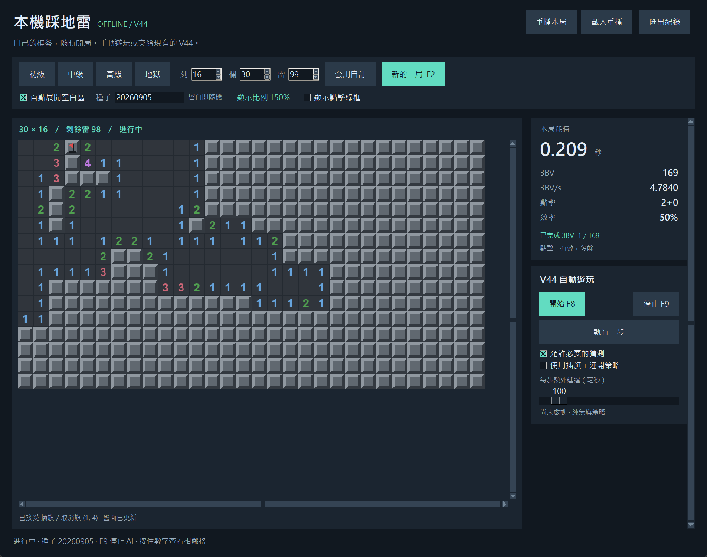

# Minesweeper AI｜離線踩地雷、V44 與重播分析

**繁體中文** · [English](README.en.md)

一個可以自己玩、交給 AI 玩，也能回頭查看每一步判斷的踩地雷專案。它包含 Windows 桌面程式、以精確推論為主的 V44 混合代理，以及保留勝敗紀錄和配對實驗結果的研究資料。

**[下載 Windows v0.1.0](https://github.com/akaJooooooker/minesweeper-ai-public/releases/tag/v0.1.0)** · [研究論文 PDF](output/research/minesweeper-research-paper.pdf) · [完整操作說明](docs/local-game.md) · [研究重現](docs/REPRODUCIBILITY.md)



> 目前提供 Windows x64 公開測試版，介面為繁體中文。程式內建 Python、CPU 版 PyTorch 與 V44 模型，遊玩與分析都在本機執行，不需要帳號、API Key 或雲端 AI 服務。

## 這個專案可以做什麼？

一般玩家可以直接下載程式，手動遊玩、觀察 AI 解盤，或重播一局看看當時是否有更安全的選擇。對求解器與機器學習有興趣的人，也能從原始碼、部署設定、模型與配對結果研究 V44 的決策流程。

| 部分 | 內容 |
| --- | --- |
| 本機遊戲 | 四種難度、自訂盤面、首點保護、插旗與連開、即時統計 |
| V44 自動遊玩 | 開始、停止、執行一步；可手動接續，設定是否允許猜測及使用旗子 |
| 重播與分析 | 棋盤時間軸、前後跳步、自動播放、落子前雷率與較安全落點 |
| 對局紀錄 | 保存勝局與敗局、操作順序、時間及可用的 AI 決策資訊 |
| 研究資料 | 歷史報告、論文、本機模擬資料、完整的新配對結果 |
| 原始碼 | 遊戲環境、約束求解器、模型推論、訓練工具、GUI 與桌面觀察器 |

## 下載、啟動與更新

### 只想玩：下載 Windows 包

1. 到 [v0.1.0 發行頁](https://github.com/akaJooooooker/minesweeper-ai-public/releases/tag/v0.1.0) 下載 **`MinesweeperAI-v0.1.0-windows-x64.zip`**，約 173 MB。
2. **完整解壓縮**，保留 `MinesweeperAI.exe` 旁的 `_internal` 資料夾。解壓後約 495 MB。
3. 雙擊 `MinesweeperAI.exe`。可以直接手動玩，或按 **F8** 啟動 AI。

不需另外安裝 Python、CUDA 或 NVIDIA 顯示卡。第一次啟動 AI 時會載入模型，等待時間依電腦而異。下載版使用 CPU 推論。

這是尚未簽章的 Windows x64 測試版，Windows 可能顯示未知發行者。請確認檔案來自本專案 Releases；發行頁的 `SHA256SUMS.txt` 可用來核對下載完整性：

```powershell
Get-FileHash .\MinesweeperAI-v0.1.0-windows-x64.zip -Algorithm SHA256
```

更新時將新版本解壓到另一個資料夾即可。下載版的對局紀錄放在使用者資料夾，不會因為替換程式目錄而被覆蓋。

### 其他下載檔案有什麼用途？

| 檔案 | 何時需要 |
| --- | --- |
| `MinesweeperAI-v0.1.0-windows-x64.zip` | 一般遊玩；含程式、執行環境、V44 與第三方授權 |
| `MinesweeperAI-v0.1.0-source.zip` | v0.1.0 發行時的原始碼快照；最新文件以本倉庫 main 分支為準 |
| `minesweeper-research-paper.pdf` / `.docx` | 閱讀研究論文；Word 版便於查看或編輯 |
| `local-experiment-data-20260906.zip` | 約 12 MB 的本機實驗資料；一般遊玩不需要 |
| `PUBLICATION_NOTES.md` | 公開範圍、歷史證據限制與打包說明 |
| `SHA256SUMS.txt` / `windows-binary-check.json` | 下載校驗碼與本次執行檔檢查紀錄 |

## 遊玩方式與統計

| 操作 | 功能 |
| --- | --- |
| 左鍵點未開格 | 按下時立即開格 |
| 右鍵 | 插旗或取消旗子 |
| 按住已開數字 | 預覽周圍未開且未插旗的格子 |
| 在同一數字上放開左鍵 | 鄰近旗數符合數字時連開；錯旗仍可能踩雷 |
| 中鍵／左右鍵組合 | 連開 |
| F2 | 新的一局 |
| F8 | 開始 AI |
| F9 / Esc | 停止 AI，之後可手動接續 |

提供初級 **9×9／10 雷**、中級 **16×16／40 雷**、高級 **30×16／99 雷**、地獄 **30×20／130 雷**，也能自訂。這裡尺寸均以「欄 × 列」表示。

首點預設展開空白區；取消後仍保證首點安全。同一種子、盤面設定與首點可重現棋盤。這些是隨機盤，**不保證整局無猜**；關閉 AI 猜測，只代表沒有可證安全動作時停下。

右側統計包含：

- **耗時**：首個有效開格後起算，結束後凍結；重播暫停期間不計。
- **3BV**：依空白區及未被空白區涵蓋的安全數字格計算的棋盤指標。
- **3BV/s**：已完成的 3BV ÷ 耗時。
- **點擊**：區分有效與多餘操作。
- **效率**：已完成 3BV ÷ 總點擊；連開時可能超過 100%。

這些是本機明確定義的指標，不宣稱完全複製其他網站的內部計分。細節與滑鼠組合操作見 [操作說明](docs/local-game.md)。

## 回到某一步，看看當時能知道什麼


按「重播本局」，或載入已匯出的 JSON，就能直接在棋盤上拖曳時間軸、上一／下一步或自動播放。返回對局時會保留原本的遊戲，AI 可再按 F8 啟動。

選擇一步後按 **「分析這一步」**，程式才會計算；同一份重播內的結果會快取。分析分成兩種資訊：

| 落子前的風險 | 落子後的實際效果 |
| --- | --- |
| 所選格的雷率與精確／估計來源 | 這步是否有改變盤面 |
| 是否有更安全的未插旗落點 | 實際展開幾個安全格 |
| 插旗位置是雷的機率 | 當時的操作與已記錄決策資訊 |
| 連開目標是否全部可證安全 | 不將結果好壞直接當作決策優劣 |

風險分析只使用**落子前已揭露的盤面與總雷數**，不讀取隱藏雷位、種子或未來結果。玩家旗子會先視為未知，避免錯旗造成假的安全判斷。非完全可證安全的連開，會顯示目標中最高的單格雷率，而不是把它當成整次連開的聯合踩雷率。

「精確雷率」是相容雷位配置假設下的計算結果；未完成精確枚舉時會標示近似或模型估計。這不是整局勝率、長期資訊價值或最優動作的保證。一次必要猜測失敗，也不表示那步一定選錯。

## V44 怎麼決定下一步？

V44 是**約束求解器與神經網路結合的代理**，不是每一步都呼叫大型語言模型。

1. 從已揭露數字推導局部約束、子集合關係及可證安全／有雷格。
2. 分析相連的前沿區域，結合全盤剩餘雷數計算機率；必要時提高枚舉上限。
3. 有安全動作時優先執行；能得到精確機率時，沿用精確推論的選擇流程。
4. 沒有安全動作、分析仍非精確時，才讓神經雷率與有條件的結果策略介入。

V44 部署使用 V40 checkpoint。JSON 部署版本與神經網路權重版本不是同一件事；目前採用的設定在 [V44 部署檔](models/replay-agent-v44.json)。

遊戲引擎需要雷位來管理棋盤與重播，但遊玩中的 AI 只取得公開觀察、總雷數與操作選項。GUI 與既有桌面觀察器共用 `LiveDecisionEngine`，停止、換局或手動改盤後，過期決策會被丟棄。[架構說明](docs/ARCHITECTURE.md)

## 研究結果，以及它們能說明的範圍

論文為 **Exact Inference and Selective Learning for Minesweeper: Paired Evaluation and Deployment Aligned Counterfactual Adaptation**。[PDF](output/research/minesweeper-research-paper.pdf) · [Word](output/research/minesweeper-research-paper.docx) · [原稿](output/research/minesweeper-study.md)

### 歷史標準盤比較

每個難度 2,000 組配對，首點只保證安全，允許已證明的插旗與連開：

| 難度 | V32 勝局 | V44 勝局 | 勝率差 |
| --- | ---: | ---: | ---: |
| 初級 | 1,669 / 2,000 | 1,668 / 2,000 | −0.05 個百分點 |
| 中級 | 1,371 / 2,000 | 1,388 / 2,000 | +0.85 個百分點 |
| 高級 | 657 / 2,000 | 690 / 2,000 | +1.65 個百分點 |

以上來自[保存的歷史報告](experiments/replay-agent-v44-blind-test.md)。原始逐局資料與完全一致的舊 solver 快照未完整保留，不能把現在的重跑描述成原實驗的完全重現。歷史速度統計只包含各代理自己的勝局，也不是相同勝局上的純速度比較。

### 新的 GUI 規則配對試驗

另外收集 **2,000 局**本機遊戲，保留 870 勝與 1,130 敗，產生 194 個反事實候選狀態；其中只有 34 個狀態的候選結果有差異。訓練後再以 **5,000 組新配對**比較候選與 V44：

| 代理 | 勝局 | 勝率 |
| --- | ---: | ---: |
| V44 | 2,189 / 5,000 | 43.78% |
| 新候選 | 2,191 / 5,000 | 43.82% |

差距為 **+0.04 個百分點**，精確 McNemar p = **0.790527**，沒有足夠證據支持升級，因此保留 V44。新候選的驗證 Brier 分數雖從約 0.2581 降至 0.2532，實際整局勝率並未出現可確認的改善。[實驗報告](experiments/local-selfplay-20260906.md)

這個試驗使用首點空白展開、純無旗與 GUI 決策引擎，不能直接和上面的標準盤勝率比較。另有 **1,696 / 1,696** 筆既有獲勝無猜重播被解出，那是篩選語料上的覆蓋結果，不是任意棋盤或所有無猜盤的 100% 保證。

本專案沒有完成與外部最強求解器的同條件比較，也不宣稱最佳演算法。[公開版補充與限制](docs/PUBLICATION_NOTES.md)

## 紀錄、資料與隱私

| 執行方式 | 自動保存對局的位置 |
| --- | --- |
| Windows 下載版 | `%LOCALAPPDATA%\MinesweeperAI\local-feedback` |
| 原始碼版 | 專案的 `data/local-feedback/` |

勝局與敗局都會保存，包含重建棋盤所需資訊及操作記錄；未完成對局可以手動匯出。**遊玩、重播與存檔不會自動訓練或更新模型**，也不會上傳紀錄。

公開資料包只包含指定的本機模擬與配對結果。匯入的第三方人類重播、私人 GUI 對局、帳號資料與原始機器錯誤日誌均未公開。模型的歷史訓練來源包含人類重播與模擬資料，公開 checkpoint 不代表已提供完整歷史訓練語料。[資料與授權範圍](NOTICE.md)

## 從原始碼執行

使用含 Tk 的 **Python 3.12**。在專案根目錄執行：

```powershell
python -m venv .venv
.\.venv\Scripts\python.exe -m pip install -r requirements/cpu.txt
.\.venv\Scripts\python.exe -m pip install --no-deps -e .
.\.venv\Scripts\minesweeper-local.exe
```

完成後可雙擊 `啟動本機踩地雷.cmd`。下載 GUI 成品不需要做以上步驟。

既有螢幕觀察器使用 `啟動桌面版.cmd`，在本機遊戲選 dark／standard、填相同盤面設定並校準角落。它是原始碼工具，不是通用外掛市集；搭配本機棋盤時需保持視窗、比例與可見範圍穩定，避免與內建 AI 同時操作。[相容方式](docs/desktop-bot.md)

Linux 原始碼執行需系統 Tk，路徑改用 `.venv/bin/`。本次沒有提供 Linux 或 macOS 成品，桌面滑鼠控制是 Windows 專用。

### 專案導覽

| 路徑 | 內容 |
| --- | --- |
| `src/minesweeper_ai/` | 遊戲、求解器、模型、GUI、重播與研究工具 |
| `models/` | V44、V32、候選部署與對應 checkpoint |
| `experiments/` | 實驗設計、結果與歷史報告 |
| `output/research/` | 論文 PDF、Word、原稿與統計 |
| `docs/` | 操作、架構、重現與證據限制 |
| `packaging/` | Windows 打包設定與指引 |
| `tests/` / `artifacts/` | 測試程式與有限的發行檢查紀錄 |

[Windows 建置](packaging/README.md) · [資料還原與研究重現](docs/REPRODUCIBILITY.md)

```powershell
.\.venv\Scripts\python.exe -m unittest discover -s tests -v
# 原生 GUI 檢查需要互動桌面
$env:RUN_LOCAL_GUI_TESTS = '1'
.\.venv\Scripts\python.exe -m unittest discover -s tests -p test_local_gui.py -v
```

本次實際 Windows 執行檔已從獨立工作目錄通過手動插旗、V44 完成一局、存檔、重播分析與返回原對局的檢查。這是有限的功能驗證，不代表跨電腦驗證或新的勝率實驗。[檢查紀錄](artifacts/windows-binary-check.json)

## 常見問題

**會越玩越強嗎？**

不會自動變強。紀錄可供之後獨立分析或訓練，但每次模型更新仍應用獨立棋盤驗證。

**為什麼 AI 還會踩雷？**

有些盤面無法從已知數字推導出必然安全的下一步。即使雷率精確，正風險的猜測仍可能失敗；也不能只靠單次結果判定動作好壞。

**為什麼分析沒有說這步增加多少整局勝率？**

目前提供落子前風險、較安全選項與事後效果。長期勝率和預期資訊價值需要額外的分支／相容棋盤模擬，尚未作為 GUI 功能提供。

**開不了程式或 AI 無法載入？**

先確認完整解壓，沒有只搬移 exe 或刪除 `_internal`。若產生啟動錯誤紀錄，可查看 `%LOCALAPPDATA%\MinesweeperAI\startup-error.log`；AI 載入錯誤也會顯示於介面。回報時請附 Windows 與程式版本、重現步驟及錯誤文字。

**有英文介面或可調顯示比例嗎？**

目前 GUI 為繁體中文，顯示比例固定 150%；英文 README 不會改變介面語言。大盤可以捲動。

## 回報問題與授權

歡迎在 [Issues](https://github.com/akaJooooooker/minesweeper-ai-public/issues) 回報問題，或提出文件與程式改善。重播檔可自行選擇是否附上；提交前請先查看其內容，不需要提供帳號、密碼或私人資料。

原創程式碼與文件採 [MIT](LICENSE)。專案作者的模型與本機模擬資料依 [NOTICE](NOTICE.md) 所述範圍提供；第三方元件保留原授權，Windows ZIP 內有 `THIRD_PARTY_LICENSES`。引用研究時請註明使用的 release 或 commit，並參考 [CITATION.cff](CITATION.cff)。
