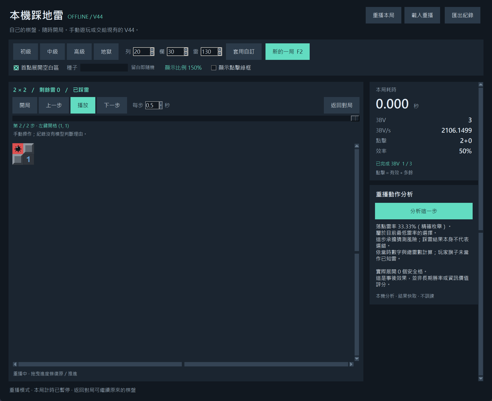

# Minesweeper AI — 離線踩地雷、V44 與重播分析

手動遊玩，或交給 V44 自動操作。回放每一步，查看落子前雷率、較安全的選擇與實際展開效果。

**[下載 Windows 版本](https://github.com/akaJooooooker/minesweeper-ai-public/releases/tag/v0.1.0)** · [操作說明](docs/local-game.md) · [論文 PDF](output/research/minesweeper-research-paper.pdf) · [研究與重現](docs/REPRODUCIBILITY.md)



## 下載與啟動

1. 在 Releases 下載 `MinesweeperAI-v0.1.0-windows-x64.zip`。
2. 將 **整個 ZIP 解壓縮**，保留 exe 旁的 `_internal` 資料夾。
3. 雙擊 `MinesweeperAI.exe`；按 F8 啟動 V44。

內建 Python、CPU 版 PyTorch 和 V44 模型，不需安裝 Python、CUDA 或登入帳號。遊玩與分析均在本機執行，不連接線上踩地雷網站、不呼叫雲端 AI。首度啟用 AI 需要載入模型。

Windows x64 測試版，固定 150% 介面，大盤可捲動。可執行檔尚未做程式碼簽章，Windows 可能顯示未知發行者；請核對本頁來源與 `SHA256SUMS.txt`。

完成的對局存於 `%LOCALAPPDATA%\MinesweeperAI\local-feedback`，更新不覆蓋紀錄，不會自動上傳或訓練。啟動錯誤紀錄：`%LOCALAPPDATA%\MinesweeperAI\startup-error.log`。

## 功能

- 初、中、高、地獄與自訂盤面；首點安全，可選首點空白展開。
- 左鍵開格、右鍵插旗、數字連開、按住預覽鄰格。
- F2 新局、F8 開始 AI、F9 / Esc 停止；可手動接續。
- 3BV、3BV/s、點擊、效率統計。
- 勝敗紀錄、JSON 匯出、棋盤重播與進度拖曳。
- 按需分析落子前雷率、較安全落點、事後展開效果，結果快取。
- 相容既有深色棋盤辨識器；桌面觀察器可由原始碼啟動。

隨機盤不保證無猜；精確雷率仍可能大於零。單步分析不是整局勝率或最優動作保證。

## 原始碼執行

使用含 Tk 的 Python 3.12，在根目錄執行：

```powershell
python -m venv .venv
.\.venv\Scripts\python.exe -m pip install -r requirements/cpu.txt
.\.venv\Scripts\python.exe -m pip install --no-deps -e .
.\.venv\Scripts\minesweeper-local.exe
```

完成後可雙擊 `啟動本機踩地雷.cmd`；桌面觀察器使用 `啟動桌面版.cmd`。原始碼版紀錄位於 `data/local-feedback/`。Linux 需系統 Tk 並改用 `.venv/bin/`；本次無 Linux/macOS 成品。

## 研究

| 實驗 | 結果與範圍 |
|---|---|
| 歷史標準盤報告，6,000 配對 | V44 3,746 勝；V32 3,697 勝。舊 solver 與逐局資料未完整保留。 |
| 既有獲勝無猜重播語料 | 1,696 / 1,696；僅篩選語料結果，不是任意盤面 100% 勝率。 |
| GUI 規則，5,000 配對 | V44 2,189 勝；候選 2,191 勝，p = 0.790527；候選未晉升。 |

不同開局規則不能直接比較。離線誤差降低未轉化成可確認的勝率提升。未與外部最強求解器作同條件比較，不宣稱最佳演算法。

[PDF](output/research/minesweeper-research-paper.pdf) · [Word](output/research/minesweeper-research-paper.docx) · [原稿](output/research/minesweeper-study.md) · [公開版補充說明](docs/PUBLICATION_NOTES.md)

## 開發

[Windows 建置](packaging/README.md)。公開版包含 GUI、研究原始碼、三個部署與權重；完整私人歷史庫與匯入資料不公開。

```powershell
.\.venv\Scripts\python.exe -m unittest discover -s tests -v
# 原生 GUI 檢查需互動桌面
$env:RUN_LOCAL_GUI_TESTS = '1'
.\.venv\Scripts\python.exe -m unittest discover -s tests -p test_local_gui.py -v
```

未設定自動 CI 或背景訓練。回報問題請附 Windows／程式版本與重現步驟，重播檔可自行選擇是否提供。

## 授權

原創程式碼與文件採 [MIT](LICENSE)。第三方套件保留原授權，ZIP 含 `THIRD_PARTY_LICENSES`。模型／資料範圍見 [NOTICE](NOTICE.md)。
