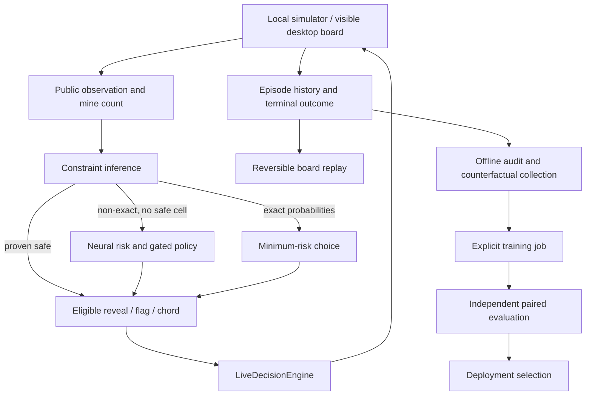

# Architecture

`game.py` owns mine placement, public observations, flood reveal, flags, chording and terminal state. Mine placement is delayed until the first reveal. Safe-only and first-zero openings are distinct experimental conditions.

`solver.py` combines local constraints, subset deductions, component enumeration and global remaining-mine accounting. V44 escalates component limits from 24 to 40 in standard play; the no-guess path uses 40 to 64. A neural estimate is eligible only where the deployment cannot obtain an exact decision and no proven safe action is available.

`replay_learning.py`, `replay_inference.py` and `replay_deployment.py` implement the learned replay policy, inference and deployment loading. The selected V44 configuration uses the V40 calibrated-abstention checkpoint. Learned risk blends with estimated solver risk; a gated top-three outcome policy can affect eligible large boards. Exact inference remains the primary decision method.

`desktop_live.py` supplies the shared `LiveDecisionEngine` used by the local GUI and desktop observer. An eligible learned choice is preserved through the adapter. Simulator mine positions and seeds are not passed to this engine. The standard CLI evaluator uses the agent's proven-flag/chord policy; GUI-aligned evaluations can use pure no-flag reveal actions, so their metrics are not interchangeable.

`local_game.py` and `local_app.py` track user actions and render the native Tk interface. Inference runs off the UI thread and stale decisions are rejected after state changes. `local_replay.py` reconstructs public board states with sparse changes and periodic checkpoints. Rewinding changes the displayed historical state, not the original session's actions or statistics. Terminal mine disclosure is a rendering operation.

`local_selfplay.py` runs the same GUI decision engine in independent worker processes. Deterministic board seeds and split membership do not depend on task completion order. Both wins and losses are retained. Counterfactual branches use hidden board state only inside the simulator to generate outcomes; their training observations remain public. Neither collection nor normal GUI use starts a training job.

`replay_analysis.py` assesses only a selected step's preceding public observation. It normalizes player flags to unknown cells before inference, labels exact versus estimated probabilities, and separates observed action effects from risk. The GUI uses its existing worker queue, one pending assessment and a replay-local cache; it discards results from an earlier replay. No cloud inference or training is invoked.
